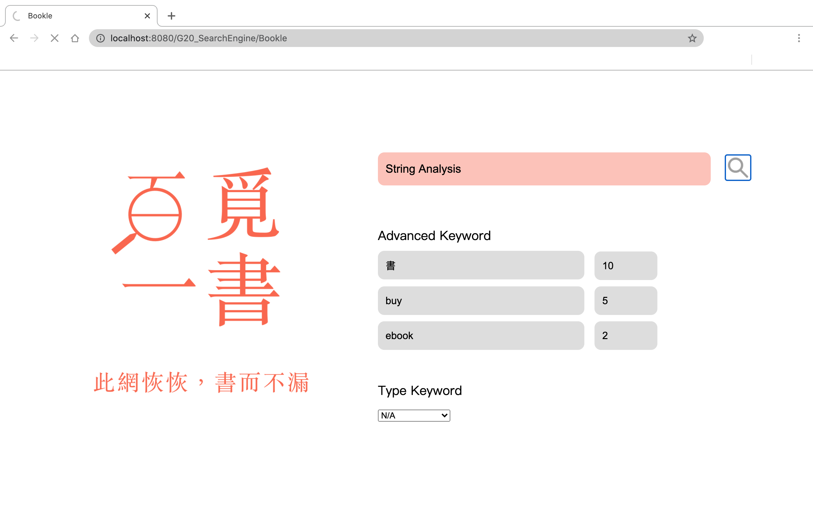
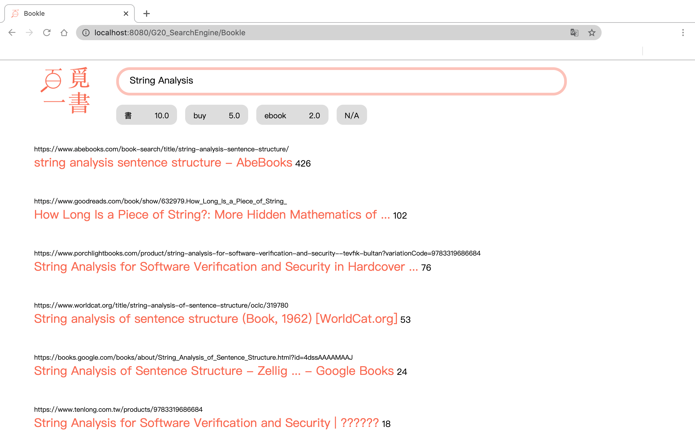

# NCCU_DS_SearchEngine
2020/21 NCCU Data Structure Project: Beat Google!  
百覓一書 書本搜尋引擎  
密度計分測試版：G20_SearchEngine/src/BookleDS.java  
最終版本：G20_SearchEngine/src/Bookle.java  
註：不需要的 advanced keyword 請於 weight 欄位輸入 0  
紅底框內輸入書名，灰底框內可輸入其他協助縮小範圍之關鍵字並於右側加入關鍵字權重  
  
結果頁面顯示如下，包含網頁連結與網頁分數顯示  
  